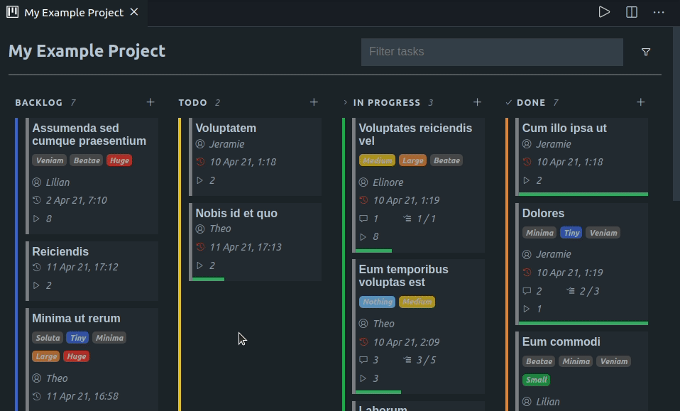
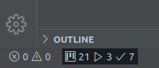

# Kanbn Extension for Visual Studio Code

This extension adds a [Kanbn](https://www.npmjs.com/package/@basementuniverse/kanbn)-powered kanban board to Visual Studio Code.



## What is Kanbn?

Kanbn is a CLI kanban application that stores the kanban board and tasks inside your repository as markdown files. This makes it easy to view and edit tasks using any editor, and it means you can benefit from Git's version control and collaboration features when doing project management.

You don't need to have Kanbn installed to use this extension.

[Check here](https://www.npmjs.com/package/@basementuniverse/kanbn) for more information about Kanbn.

## How do I install this extension?

To install the extension, open the Extensions view, search for `kanbn` to filter results and select 'Kanbn Extension for Visual Studio Code'.

## What does this extension add?

When you open a workspace, there will be a new item in the status bar. If Kanbn isn't already initialised in the open workspace, clicking this item will allow you to initialise a new Kanbn project.



If Kanbn is initialised, the status bar item will display the total number of tasks, the number of tasks that have been started and the number of completed tasks. Click on the status bar item to open the Kanbn board.

On the Kanbn board, you can move tasks between columns, filter visible tasks and create new tasks.

Click on a task's title to open the task editor in a new tab. From here, you can modify or delete tasks.

You can also modify the index or task files directly, or by using Kanbn CLI commands, and the Kanbn board should update automatically to reflect these changes.

## Commands

The following commands are available:

- `Kanbn: Initialise Kanbn` will initialise Kanbn in the open workspace.
- `Kanbn: Open board` will open open the Kanbn board.
- `Kanbn: Open burndown chart` will open a burndown chart.
- `Kanbn: Add task` will open the task editor.
- `Kanbn: Archive tasks` will send tasks to the archive.
- `Kanbn: Restore tasks` will restore tasks from the archive.

## Configuration settings

The following configuration settings are available:

- `kanbn.showUninitialisedStatusBarItem` when set to `true`, the status bar item will be displayed in workspaces where Kanbn has not yet been initialised. If set to `false`, Kanbn can still be initialised using the `Kanbn: Initialise Kanbn` command.
- `kanbn.showTaskNotifications` when set to `true`, notifications will be displayed when a task is created, updated or deleted.
- `kanbn.autoSave` can be set to `inherit`, `off`, `afterDelay`, `onWindowChange` or `onWindowChangeWithoutDelay`. This setting controls when task edits will be automatically saved. If set to `inherit`, the setting will be inherited from the global VS Code settings.
- `kanbn.autoSaveDelay` when `kanbn.autoSave` is set to `afterDelay`, this setting controls the delay (in milliseconds) before task edits are automatically saved.
- `kanbn.showSprintButton` when set to `true`, a 'Start sprint` button will will appear above the Kanbn board. This button will show the current sprint name if a sprint is currently active, and can be used to start a new sprint.
- `kanbn.showBurndownButton` when set to `true`, a 'Show burndown chart` button will appear above the Kanbn board.
- `kanbn.showGanttButton` when set to `true`, a 'Show Gantt chart` button will appear above the Kanbn board.

## Filtering the Kanbn board

At the top-right of the Kanbn board there is a filter input. To filter visible tasks, enter a filter string and click the filter button (or press Enter).

### Filter string syntax

Text entered into the filter string input will be tested against each task's `id` and `name` fields. To filter on other fields, try the following:

- `overdue` will filter all tasks that have a due date in the past
- `description:search-string` will filter for tasks that contain `search-string` in their description or sub-tasks
- `assigned:search-string` will filter for tasks that contain `search-string` in their assigned user
- `tag:search-string` will filter for tasks that contain `search-string` in one of their tags
- `relation:search-string` will filter for tasks that contain `search-string` in one of their relations (either the relation type or related task id)
- `subtask:search-string` will filter for tasks that contain `search-string` in one of their sub-tasks
- `comment:search-string` will filter for tasks that contain `search-string` in one of their comments (either the comment author or text)
- `{custom field name}:search-string` will filter for tasks that have a custom field in their metadata that contains `search-string` in its value
- `{boolean custom field name}` will filter for tasks that have a boolean custom field in their metadata set to true

#### Examples

For these examples, assume we have a string custom field 'MyCustomField' and a boolean custom field 'MyCustomFlag' defined in the project options, i.e. `index.md` will contain:
```yaml
customFields:
  - name: MyCustomField
    type: string
  - name: MyCustomFlag
    type: boolean
```

(See https://github.com/basementuniverse/kanbn/blob/master/docs/index-structure.md for more information on custom fields)

- `assigned:testperson tag:large mycustomflag` will show tasks that are assigned to `testperson` and have a tag `Large` (search terms are case-insensitive) and have `MyCustomFlag` set to true
- `mycustomfield:test123 some title` will show tasks that have both `some` and `title` in their name/id and have a `MyCustomField` field that contains `test123`

## Views

A view is a saved board layout: its own columns, lanes and filters over the same tasks, without moving anything or changing the board's columns. Views are configured in the board file (or in `kanbn.yml` / `kanbn.json`) — [check here](https://github.com/basementuniverse/kanbn/blob/master/docs/views.md) for how to write one.

If a board has views configured, a picker appears in the board header next to the filter input. Select a view to show it, or 'Board' to go back to the normal board.

A view is read-only. Its columns are filters with a label on them rather than the board's own columns, so there's no move that corresponds to dragging a card from one to another — tasks can't be dragged while a view is showing, and the header says so. Everything else still works: you can search and filter within a view, and clicking a task's title opens it in the task editor as usual.

A view with lanes is drawn as a stack of lanes under one row of column headings, one row per lane. Tasks that don't match any lane aren't shown, and a task that matches more than one column or lane appears in each of them.

## Styling the Kanbn board

This extension has been tested using various themes (light, dark and high-contrast), so it should always look somewhat presentable. However, if you'd like to set your own styles you can do so by creating a CSS file called `board.css` in the Kanbn directory. [Check here](docs/styles.md) for more information.
